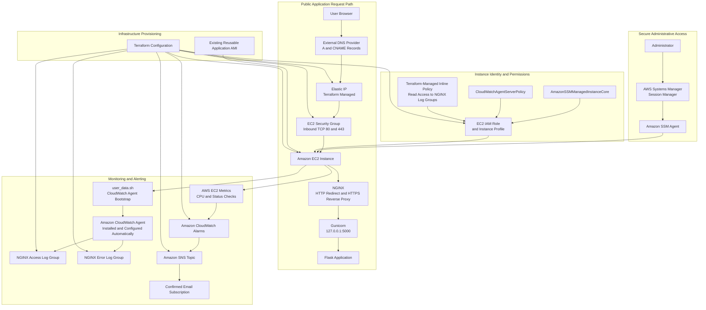

# Terraform Infrastructure

This directory contains the Terraform configuration used to provision and manage the AWS infrastructure for the Cloud Support Platform.

The environment demonstrates infrastructure automation, secure administration, automated instance bootstrap, observability, DNS migration, HTTPS validation, and production-style troubleshooting across AWS, Linux, NGINX, Flask, CloudWatch, SNS, and Terraform.

## Project Status

The Terraform-managed environment is operational and publicly available at:

* `https://edikanekong.online`
* `https://www.edikanekong.online`

### Completed

* Provisioned an EC2 instance from a reusable AMI
* Created and associated a persistent Elastic IP
* Configured public HTTP and HTTPS access
* Enabled NGINX reverse proxying to the Flask application
* Configured HTTP-to-HTTPS redirection
* Connected the production domain to the Terraform-managed server
* Migrated administrative access from SSH to AWS Systems Manager
* Removed inbound SSH access from the security group
* Integrated CloudWatch log collection
* Automated CloudWatch Agent installation and configuration through `user_data.sh`
* Automated NGINX access and error log collection during instance bootstrap
* Configured CPU and EC2 status-check alarms
* Configured SNS alarm and recovery notifications
* Validated DNS, HTTPS, NGINX, Flask, SSM, and CloudWatch functionality
* Confirmed that Terraform reports no configuration drift
* Added a Terraform-managed, least-privilege CloudWatch Logs reader policy for the AI Log Analyzer
* Decommissioned the original manually created EC2 environment and its legacy AWS resources

### Planned Improvements

* Manage DNS records directly through Terraform
* Add automated deployment and rollback procedures
* Expand application-level health checks
* Add memory and disk monitoring
* Add automated infrastructure validation in CI/CD
* Reduce the remaining dependency on the reusable application AMI

## Implementation Milestones

| Milestone                  | Status   | Outcome                                                                         |
| -------------------------- | -------- | ------------------------------------------------------------------------------- |
| EC2 provisioning           | Complete | Instance created from a reusable AMI                                            |
| Elastic IP                 | Complete | Stable public IP assigned to the instance                                       |
| Secure administration      | Complete | SSM enabled and inbound SSH blocked                                             |
| HTTP and HTTPS             | Complete | Public web traffic permitted on ports 80 and 443                                |
| DNS migration              | Complete | Root and `www` domains point to the Terraform-managed server                    |
| TLS validation             | Complete | HTTPS requests return successful responses                                      |
| Monitoring                 | Complete | NGINX logs, CloudWatch alarms, and SNS notifications operational                |
| AI log access              | Complete | Least-privilege CloudWatch Logs read access managed by Terraform                |
| Legacy decommissioning     | Complete | Original EC2 environment and obsolete resources removed safely                  |
| CloudWatch Agent bootstrap | Complete | Agent installation and NGINX log configuration automated through `user_data.sh` |
| Terraform-managed DNS      | Planned  | DNS records are currently managed through the external DNS provider             |
| CI/CD validation           | Planned  | Terraform checks are currently run manually                                     |

## Managed Infrastructure

Terraform provisions and manages:

* An EC2 security group allowing public HTTP and HTTPS traffic
* An EC2 instance created from an existing reusable AMI
* An Elastic IP associated with the EC2 instance
* Instance bootstrap through `user_data.sh`
* Automated CloudWatch Agent installation and configuration
* Automated NGINX access and error log collection
* An EC2 IAM role and instance profile
* AWS Systems Manager Session Manager access
* Amazon CloudWatch Agent permissions
* Least-privilege CloudWatch Logs read permissions for the AI Log Analyzer
* NGINX access and error log groups
* CPU and EC2 status-check alarms
* An SNS topic for monitoring notifications
* Terraform outputs for application access and administration

## Architecture



The public request path begins with DNS records managed through the external DNS provider. The root domain resolves to the Terraform-managed Elastic IP, which directs traffic through the EC2 security group to NGINX.

NGINX redirects HTTP traffic to HTTPS and proxies HTTPS application requests to Gunicorn on `127.0.0.1:5000`. Gunicorn serves the Flask application without exposing the application port publicly.

Administrative access follows a separate path through AWS Systems Manager Session Manager. The EC2 instance uses an IAM instance profile and the Amazon SSM Agent, allowing shell access without exposing inbound SSH on TCP port 22.

During instance bootstrap, `user_data.sh` installs the Amazon CloudWatch Agent, creates its NGINX log-collection configuration, starts the agent, and enables it for future reboots.

The CloudWatch Agent sends NGINX access and error logs to Terraform-managed CloudWatch log groups. Native EC2 metrics feed CloudWatch alarms, which publish alarm and recovery events to an SNS topic with a separately confirmed email subscription.

Terraform manages the AWS infrastructure shown in the diagram, while DNS records remain externally managed.

The EC2 instance is still created from an existing reusable AMI. The AMI currently provides the deployed application stack, including NGINX, Gunicorn, Flask application files, systemd service definitions, TLS certificates, and the Amazon SSM Agent.

CloudWatch Agent installation and NGINX log configuration are no longer dependent solely on the custom AMI.

## Security Architecture

Administrative access is provided through AWS Systems Manager Session Manager.

The EC2 security group does not expose inbound SSH on TCP port 22.

The security group permits:

* HTTP on TCP port 80 from the internet
* HTTPS on TCP port 443 from the internet
* Outbound traffic required by the operating system, SSM Agent, CloudWatch Agent, package installation, and application services
* No inbound SSH access

The EC2 instance uses a dedicated IAM role with an EC2 trust policy.

The role includes the following AWS-managed policies:

* `AmazonSSMManagedInstanceCore`
* `CloudWatchAgentServerPolicy`

Terraform also manages an inline least-privilege policy that allows the EC2-hosted AI Log Analyzer to discover CloudWatch log groups and read events only from the NGINX access and error log groups.

The IAM role is attached to the instance through an instance profile.

The existing EC2 key pair remains associated with the instance because removing `key_name` could trigger instance replacement. However, the key pair cannot be used for direct inbound SSH while port 22 remains blocked.

## DNS and HTTPS Architecture

The application is available through:

```text
https://edikanekong.online
https://www.edikanekong.online
```

The root domain uses an A record pointing to the Terraform-managed Elastic IP.

```text
Type: A
Host: @
Value: Terraform-managed Elastic IP
```

The `www` hostname uses a CNAME record pointing to the root domain.

```text
Type: CNAME
Host: www
Value: edikanekong.online
```

An Elastic IP provides a stable public address for DNS. A standard EC2 public IPv4 address may change if an instance is stopped or replaced.

Terraform currently exposes the application domain through outputs, but the DNS records themselves are managed separately through the external DNS provider.

## Prerequisites

* Terraform 1.6 or later
* AWS CLI
* AWS credentials configured outside the repository
* AWS permission to manage EC2 resources
* AWS permission to manage security groups and Elastic IPs
* AWS permission to manage IAM roles, instance profiles, and policy attachments
* AWS permission to manage CloudWatch, CloudWatch Logs, and SNS
* Permission to start AWS Systems Manager sessions
* An existing reusable AMI in the selected AWS region
* NGINX, Gunicorn, Flask application files, systemd service definitions, and TLS configuration included in the AMI
* An active Amazon SSM Agent included in the AMI
* Outbound network access so the instance can install the CloudWatch Agent and communicate with AWS service endpoints
* An existing EC2 key pair
* Session Manager plugin for command-line access

The AWS Console can also be used to start a Session Manager session.

Do not commit:

* AWS credentials
* Private keys
* `terraform.tfvars`
* `.terraform/`
* Terraform state files
* Terraform plan files

## Variables

| Name            | Required | Description                                        | Example                  |
| --------------- | -------: | -------------------------------------------------- | ------------------------ |
| `aws_region`    |       No | AWS region where resources are created             | `ca-central-1`           |
| `project_name`  |       No | Name used for resource names and tags              | `cloud-support-platform` |
| `ami_id`        |      Yes | Existing AMI used to create the EC2 instance       | `ami-0123456789abcdef0`  |
| `instance_type` |       No | EC2 instance type                                  | `t3.micro`               |
| `key_name`      |      Yes | Existing key pair associated with the EC2 instance | `your-existing-key-pair` |
| `domain_name`   |       No | Primary domain used by the application outputs     | `edikanekong.online`     |

## Local Configuration

Create a local `terraform.tfvars` file from the safe example.

PowerShell:

```powershell
Copy-Item terraform.tfvars.example terraform.tfvars
```

Bash:

```bash
cp terraform.tfvars.example terraform.tfvars
```

Edit `terraform.tfvars` with the required local values.

The real `terraform.tfvars` file is ignored by Git and must not be committed.

## Terraform Workflow

Run the following commands from this directory.

Format the configuration:

```bash
terraform fmt -recursive
```

Initialize Terraform:

```bash
terraform init
```

Validate the configuration:

```bash
terraform validate
```

Review the execution plan:

```bash
terraform plan
```

Apply the approved plan:

```bash
terraform apply
```

Terraform operations may create chargeable AWS resources.

Always review the plan carefully before applying changes.

## Expected Outputs

Terraform exposes the following outputs:

* `instance_id`: EC2 instance ID
* `elastic_ip`: Elastic IP associated with the instance
* `public_dns`: Public EC2 DNS hostname
* `application_url`: Primary HTTPS application URL
* `website_http_url`: HTTP URL that redirects to HTTPS
* `website_https_url`: Primary HTTPS URL
* `www_https_url`: HTTPS URL using the `www` hostname
* `session_manager_command`: AWS CLI command for Session Manager access
* `sns_topic_arn`: SNS topic used by CloudWatch alarms

Display all outputs:

```bash
terraform output
```

Display the application URL:

```bash
terraform output -raw application_url
```

Display the Elastic IP:

```bash
terraform output -raw elastic_ip
```

Display the Session Manager command:

```bash
terraform output -raw session_manager_command
```

## Connecting Through Session Manager

Display the generated Session Manager command:

```bash
terraform output -raw session_manager_command
```

The generated command follows this format:

```bash
aws ssm start-session \
  --target <instance-id> \
  --region ca-central-1
```

You can also connect through the AWS Console:

1. Open Amazon EC2.
2. Select **Instances**.
3. Select the Terraform-managed instance.
4. Choose **Connect**.
5. Select **Session Manager**.
6. Choose **Connect**.

## Instance Bootstrap

Terraform passes `terraform/user_data.sh` to the EC2 instance as user data.

The bootstrap script:

* Enables strict Bash error handling with `set -euo pipefail`
* Writes bootstrap output to `/var/log/user-data.log`
* Installs the `amazon-cloudwatch-agent` package
* Starts and enables NGINX
* Starts and enables the Flask application service
* Ensures the NGINX log files exist
* Creates the CloudWatch Agent configuration
* Configures NGINX access and error log collection
* Starts the CloudWatch Agent
* Enables the CloudWatch Agent for future reboots

The bootstrap script reduces dependency on the reusable AMI but does not eliminate it.

The AMI still provides:

* NGINX
* Gunicorn
* Flask application files
* The `flaskapp` systemd service
* NGINX virtual-host configuration
* TLS certificates
* Amazon SSM Agent
* Other application-specific operating-system configuration

A future improvement would deploy the complete application stack from a clean base Amazon Linux image rather than relying on a preconfigured application AMI.

## Monitoring and Alerting

### CloudWatch Agent

The EC2 IAM role includes `CloudWatchAgentServerPolicy`, allowing the CloudWatch Agent to publish logs and custom metrics.

The same role also includes a Terraform-managed inline policy that grants the AI Log Analyzer read access to the NGINX CloudWatch log groups without using a broader legacy `Resource: "*"` log-reader policy.

CloudWatch Agent installation and configuration are automated through `user_data.sh`.

During instance bootstrap, the script:

* Installs the `amazon-cloudwatch-agent` package
* Creates the CloudWatch Agent configuration directory
* Creates the NGINX log-collection configuration
* Uses the EC2 instance ID as the CloudWatch log-stream name
* Starts the CloudWatch Agent
* Enables the agent to start automatically after future reboots
* Records bootstrap output in `/var/log/user-data.log`

The generated configuration is stored at:

```text
/opt/aws/amazon-cloudwatch-agent/etc/cloudwatch-agent.json
```

The configuration collects:

```text
/var/log/nginx/access.log
/var/log/nginx/error.log
```

and sends those files to:

```text
/ec2/flask-nginx/access
/ec2/flask-nginx/error
```

For the existing Terraform-managed EC2 instance, the updated bootstrap script was executed manually after the Terraform user-data update.

Future EC2 instances created using this Terraform configuration will execute the CloudWatch Agent bootstrap automatically during their initial launch.

### Log Collection

| Local log                   | CloudWatch log group      | Retention |
| --------------------------- | ------------------------- | --------: |
| `/var/log/nginx/access.log` | `/ec2/flask-nginx/access` |   14 days |
| `/var/log/nginx/error.log`  | `/ec2/flask-nginx/error`  |   14 days |

The log groups existed before the Terraform monitoring implementation.

They were imported into Terraform state rather than recreated.

Log streams use the EC2 instance ID, allowing events from the original and Terraform-managed instances to remain distinguishable.

### CloudWatch Alarms

| Alarm                                        | Metric                      | Condition                                                           |
| -------------------------------------------- | --------------------------- | ------------------------------------------------------------------- |
| `cloud-support-platform-high-cpu`            | `AWS/EC2 CPUUtilization`    | Average CPU at or above 80% for two consecutive five-minute periods |
| `cloud-support-platform-status-check-failed` | `AWS/EC2 StatusCheckFailed` | Maximum value of 1 for two consecutive one-minute periods           |

Both alarms send SNS notifications when entering the `ALARM` state and when recovering to `OK`.

The alarms are notification-only.

They do not automatically reboot, stop, recover, or terminate the EC2 instance.

### SNS Notifications

Terraform manages the SNS topic:

```text
cloud-support-platform-alerts
```

Display its ARN:

```bash
terraform output -raw sns_topic_arn
```

Email subscriptions are created and confirmed separately because Amazon SNS requires recipients to approve email delivery.

Recipient email addresses are not stored in the repository.

## DNS Verification

Verify the root domain:

```powershell
nslookup edikanekong.online
```

Verify the `www` hostname:

```powershell
nslookup www.edikanekong.online
```

Query public DNS resolvers when troubleshooting cached records:

```powershell
nslookup edikanekong.online 1.1.1.1
nslookup edikanekong.online 8.8.8.8
```

Verify HTTP-to-HTTPS redirection:

```powershell
curl.exe -I http://edikanekong.online
```

Expected result:

```text
HTTP/1.1 301 Moved Permanently
Location: https://edikanekong.online/
```

Verify HTTPS:

```powershell
curl.exe -I https://edikanekong.online
curl.exe -I https://www.edikanekong.online
```

Expected result:

```text
HTTP/1.1 200 OK
```

## Pre-Migration Server Validation

Before updating public DNS, a new server can be tested using `curl --resolve`.

Test the root domain:

```powershell
curl.exe -I --resolve edikanekong.online:443:<elastic-ip> https://edikanekong.online
```

Test the `www` hostname:

```powershell
curl.exe -I --resolve www.edikanekong.online:443:<elastic-ip> https://www.edikanekong.online
```

This allows validation of:

* NGINX virtual-host routing
* TLS certificate compatibility
* HTTPS connectivity
* Gunicorn availability
* Flask application responses

The test bypasses public DNS and sends the requested hostname directly to the specified IP address.

## Troubleshooting

### DNS resolves to the wrong IP

Confirm that the root A record points to the Terraform-managed Elastic IP.

```bash
terraform output -raw elastic_ip
```

Compare that value with:

```powershell
nslookup edikanekong.online
```

### The domain works but the IP does not

NGINX may be configured to respond only to the application hostnames:

```text
edikanekong.online
www.edikanekong.online
```

Testing the raw IP may produce an empty response if no default NGINX virtual host is configured.

Use `curl --resolve` to test the server with the correct hostname.

### HTTP does not redirect to HTTPS

Review the NGINX configuration:

```bash
sudo nginx -t
sudo systemctl status nginx
```

Review the HTTP server block and confirm that it returns a redirect to the HTTPS URL.

### HTTPS fails

Check the certificate and NGINX configuration:

```bash
sudo nginx -t
sudo systemctl status nginx
```

Review NGINX errors:

```bash
sudo tail -n 100 /var/log/nginx/error.log
```

### The application is unavailable

Check NGINX:

```bash
sudo systemctl status nginx
```

Check the Flask application service:

```bash
sudo systemctl status flaskapp
```

Review recent logs:

```bash
sudo tail -n 100 /var/log/nginx/access.log
sudo tail -n 100 /var/log/nginx/error.log
```

Check listening ports:

```bash
sudo ss -tulpn
```

Test the local application endpoint:

```bash
curl -I http://127.0.0.1:5000
```

### Session Manager is unavailable

Confirm that the SSM Agent is running:

```bash
sudo systemctl status amazon-ssm-agent
```

Confirm that the EC2 instance has the correct IAM instance profile attached.

Confirm that the instance can reach the AWS Systems Manager endpoints.

### CloudWatch Agent bootstrap failed

Review the user-data bootstrap log:

```bash
sudo tail -n 100 /var/log/user-data.log
```

Confirm that the CloudWatch Agent package is installed:

```bash
rpm -q amazon-cloudwatch-agent
```

Confirm that the generated configuration exists:

```bash
sudo cat /opt/aws/amazon-cloudwatch-agent/etc/cloudwatch-agent.json
```

### CloudWatch logs are missing

Check the CloudWatch Agent service:

```bash
sudo systemctl status amazon-cloudwatch-agent --no-pager
```

Check the CloudWatch Agent status:

```bash
sudo /opt/aws/amazon-cloudwatch-agent/bin/amazon-cloudwatch-agent-ctl -a status
```

Review the agent log:

```bash
sudo tail -n 100 /opt/aws/amazon-cloudwatch-agent/logs/amazon-cloudwatch-agent.log
```

Confirm that the IAM role includes `CloudWatchAgentServerPolicy`.

Confirm that these files exist and contain recent events:

```bash
sudo ls -l /var/log/nginx/access.log
sudo ls -l /var/log/nginx/error.log
sudo tail -n 20 /var/log/nginx/access.log
sudo tail -n 20 /var/log/nginx/error.log
```

## Validation Results

Validated through July 23, 2026.

### Infrastructure

* Terraform configuration passed `terraform validate`.
* Terraform formatting checks passed.
* Terraform successfully managed the EC2 instance and Elastic IP.
* Terraform updated the EC2 user-data configuration in place.
* The user-data update produced a plan of `0 to add, 1 to change, 0 to destroy`.
* The user-data update did not destroy or replace the EC2 instance.
* The CloudWatch Logs reader policy was added without replacing the EC2 instance or IAM role.
* `terraform plan` reported no configuration drift after legacy resource cleanup.

### Secure Administrative Access

* Terraform created the EC2 IAM role.
* Terraform created the SSM policy attachment and instance profile.
* The instance profile was attached without replacing the EC2 instance.
* A Session Manager shell opened successfully.
* The session operated as `ssm-user`.
* The Amazon SSM Agent reported `active`.
* External TCP connections to port 22 failed.
* External TCP connections to ports 80 and 443 succeeded.

### DNS and HTTPS

* The root A record was updated to the Terraform-managed Elastic IP.
* `edikanekong.online` resolved to the Terraform-managed server.
* `www.edikanekong.online` resolved through its CNAME to the root domain.
* HTTP requests returned `301 Moved Permanently`.
* HTTP traffic redirected to `https://edikanekong.online/`.
* HTTPS requests to the root domain returned `200 OK`.
* HTTPS requests to the `www` hostname returned `200 OK`.
* The new server was validated before DNS migration using `curl --resolve`.
* The NGINX virtual host, TLS certificate, and Flask application were validated independently of public DNS.

### Monitoring and Alerting

* The CloudWatch Agent installation and configuration were added to `user_data.sh`.
* The updated bootstrap script completed successfully on the active EC2 instance.
* The bootstrap created the CloudWatch Agent configuration at `/opt/aws/amazon-cloudwatch-agent/etc/cloudwatch-agent.json`.
* The Amazon CloudWatch Agent reported `active` and `running`.
* NGINX access and error log streams appeared for the Terraform-managed instance.
* Both imported log groups were configured with 14-day retention.
* Future EC2 instances will install and configure the CloudWatch Agent automatically during initial launch.
* The CPU and status-check alarms reached a healthy `OK` state.
* The SNS email subscription was confirmed.
* A controlled CPU test changed the alarm from `OK` to `ALARM` and back to `OK`.
* Alarm and recovery emails were delivered.
* CloudWatch recorded the complete `INSUFFICIENT_DATA → OK → ALARM → OK` state history.
* The active EC2 role successfully read events from both NGINX CloudWatch log groups.

## Decommissioned Legacy Resources

The original manually created environment was decommissioned after the Terraform-managed replacement was fully validated.

The following legacy resources were removed:

* Original EC2 instance
* Original EC2 root EBS volume
* Legacy `tse-*` CloudWatch alarms
* `Default_CloudWatch_Alarms_Topic`
* Legacy IAM role and instance profile
* Legacy `launch-wizard-1` security group

Before termination, the original server was preserved as the reusable `cloud-support-platform-v1` AMI used to launch the Terraform-managed EC2 instance.

The custom AMI and its associated snapshot remain available for recovery and reproducible instance creation.

The custom AMI continues to provide the deployed application stack, including NGINX, Gunicorn, Flask application files, systemd service definitions, TLS certificates, and the Amazon SSM Agent.

CloudWatch Agent installation and NGINX log configuration are now handled separately through `user_data.sh`.

The AI Log Analyzer permissions previously attached to the legacy IAM role were recreated as a least-privilege Terraform-managed inline policy on the active EC2 role.

The live application remained available throughout the cleanup. Both public HTTPS endpoints returned `200 OK`, and the final Terraform plan reported no configuration drift.

## Known Limitations

* DNS records are not currently managed by Terraform.
* The EC2 instance still depends on the reusable custom AMI for NGINX, Gunicorn, Flask application files, systemd service definitions, TLS certificates, and the Amazon SSM Agent.
* `user_data.sh` automates CloudWatch Agent setup but does not yet deploy the complete application stack from a clean base Amazon Linux image.
* The existing EC2 key pair remains attached to avoid instance replacement.
* Application deployment is not yet handled through CI/CD.
* Rollback procedures are currently manual.
* Memory and disk alarms are not yet included in the Terraform configuration.
* CloudWatch Agent configuration is stored directly in the bootstrap script rather than in AWS Systems Manager Parameter Store or another centralized configuration service.
* The current architecture uses a single EC2 instance and does not provide automatic failover or horizontal scaling.

## Cleanup

Review the destruction plan before removing infrastructure:

```bash
terraform plan -destroy
```

Only after confirming the targeted resources should be removed:

```bash
terraform destroy
```

Because the NGINX log groups are managed by Terraform, `terraform destroy` will delete those log groups and their stored events.

Export any logs that must be retained before destroying the environment.

The following resource remains outside this Terraform state and requires separate review:

* DNS records managed through the external DNS provider

The reusable AMI and its associated snapshot are also outside this Terraform state and require separate review before deletion.

Do not run `terraform destroy` against infrastructure that is still required.
